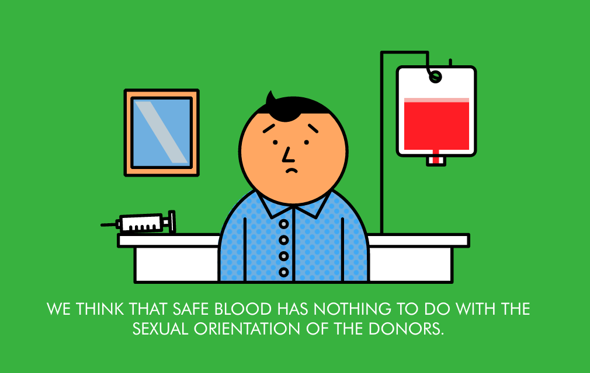

# Sharing is caring

This project is about using code (HTML, CSS and a dash of JavaScript) creatively to communicate and advocate a **cause** you care about.

A cause is a *response to an issue* that affects or concerns many people. A cause implies a *struggle to change* something. Advocating a cause means to argue for it, *persuading* other people support that cause and take action. 

1. **Pick a cause** you care about.
* **Research the issue(s)** around it and the responses people are advocating.
* Select the **key information** you want to communicate about your cause.
* Decide what **action(s)** you want people to take on your cause (eg: sign a petition, join a group, share your campaign, donate, etc.)
* **Storyboard** a few ideas of how you can advocate your cause through a one-page website. 
* Structure your information and call(s) to action with **HTML**.
* Use **CSS** (and possibly some JavaScript) to make your communication memorable. You may want to look for code libraries, tutorials or snippets to use in your project (see [resources](#resources) below).
* **Publish** your sketches, written ideas, code experiments and the finished page to GitHub.

#### Timeline

* 6th of January: project start
* January: weekly tutorials and project revisions
* 3rd of February: formative presentations
* 10th of June: final hand-in (together with other, bigger projects, so it's advised you get the bulk of this project done in January & February)

### Not sure which cause to pick?

Get some inspirations here:

* [Change.org](https://www.change.org)
* [The Megaproblems of the 21st Century](http://www.jamesmartin.com/book/megaproblems.cfm)

Or look for causes addressing one of the following *issues* (grouped into macro-categories):

* **Economy**: recession, financial crisis, poverty, debt, workers rights, wealth redistribution, free market,  market regulation
* **Environment and energy**: pollution, sustainability, environmental justice, climate change, energy crisis, waste management, CO2 emissions, agricultural production
* **Human rights**: tolerance, racism, sexism, homophobia, same-sex marriage, bullying, discrimination, inclusion of disabled people, women's rights, mental health, immigration rights
* **Technology**: governmental and/or corporate control over communication channels, censorship, anonymity, privacy, copyright and authorship, information credibility, digital reputation, digital divide, freedom of speech
* **Education**: access for the less advantaged/privileged, right to learn, gender balance, test-driven culture, life and vocational skills, apprenticeships, students loans

By no means the above is an exhaustive list of issues. You're welcome to choose a cause addressing issues that are not listed here. 

### Inspiring projects

* [Water](http://www.angelamorelli.com/water/) by Angela Morelli
* [Snowfall](http://www.nytimes.com/projects/2012/snow-fall) by the New York Times
* [Blood](http://buntspenden.bleech.de/en/) by Bleech
* [Tunnel rats](http://www.framescollection.com/tunnelrats.html) by Nathan Lampe et al
* [Skip showers for beef](http://www.skipshowersforbeef.com/) by the Yes Men

### Resources

* [Visualising information for advocacy](http://visualisingadvocacy.org/) features tools and techniques that you can use to *make strong arguments and communicate them using strong evidence*.
* [ScrollMagic](http://scrollmagic.io) is a JavaScript library for *magical scroll interactions*.
* [Codrops tutorials](http://tympanus.net/codrops/category/tutorials/), eg: [Animated map path for interactive storytelling](http://tympanus.net/codrops/2015/12/16/animated-map-path-for-interactive-storytelling/)

<!--
Today:

1. Form teams.
* Start photographing objects around Ravensbourne.
* Set up a GitHub repository for your team project.

Between today and next week:

1. Continue capturing images, both individually and as a team. You may want to borrow a DSLR camera from the CLR...
* Edit images (optional). 
* Record your creative process in your blogs.

Next week:

1. Review your work in class
* What have you made?
* How can you improve it?

Formative presentation (28.10):

1. Present your work as a team, both process and results.
* Reflect on what you learned from it.
-->