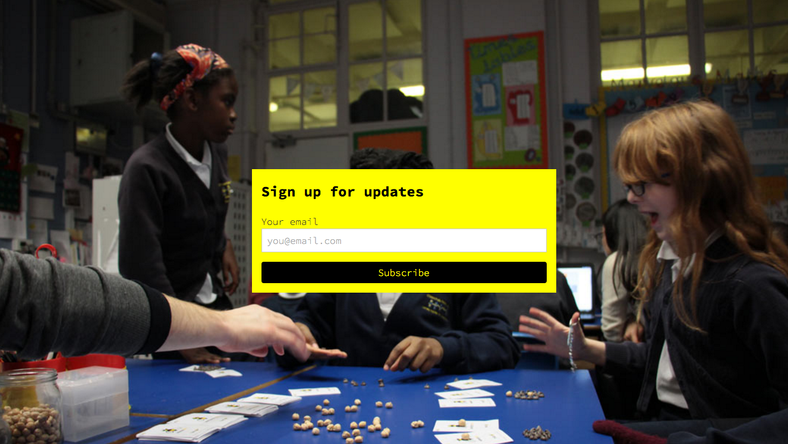
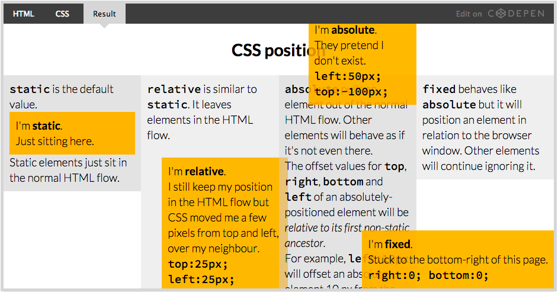
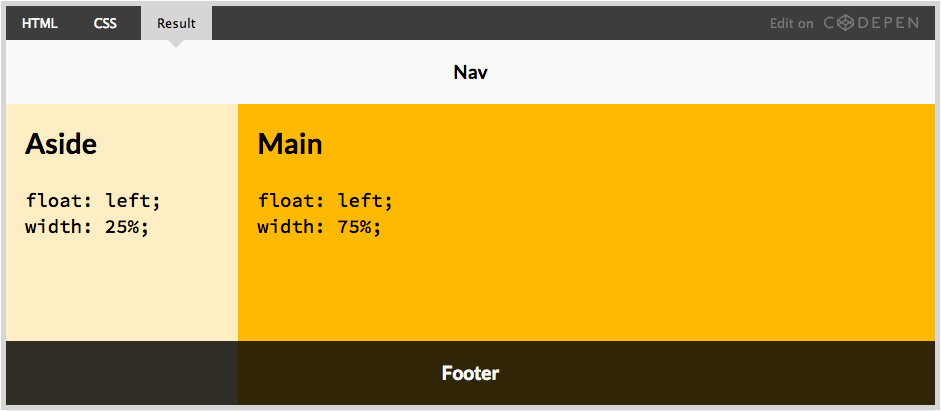

# Week 2

### Today, Wednesday 13th January 2016

1. Workshop: [HTML, CSS & GitHub recap](#workshop) 
* Tutorials on [*Sharing is caring*](#project)
* BONUS: Principles of programming

<!--Workshop: scroll magic (NEXT WEEK)-->

### Your [homework](#homework) and [blog](#blog)!


# Workshop

We're going to refresh our working knowledge of HTML, CSS and GitHub, and learn a few new **CSS tricks** that can come useful for your [*Sharing is caring*](#project) brief.

Last week we've learned how to:

* Get images to fill up the whole browser's window, without loosing their original aspect ratio (`background-size: cover`)
* Position elements in the horizontal and vertical centre of the page (using the `position: absolute, top: 50%, left: 50% and negative margin` trick)
* Create *curtain reveal* effect with CSS only (`background-attachment: fixed`)

Here's [all the code for the finished thing](../../resources/css-curtain).

[](../../resources/css-curtain)

- [ ] demo how the signup form is centred 
- [ ] check out the peer-learning video to explain position relative/absolute  
- [ ]  flexbox? http://flexboxfroggy.com/

This week we'll learn how to:

* Use Git to publish your page on [GitHub Pages](https://pages.github.com), the free hosting service from GitHub.

### Publishing on GitHub pages

- [ ] use instructions from Dynamic Web
- [ ] check out tutorial from Doug?

### Making sense of CSS `position` and `float`

> Laying out content using CSS is easy. You chop your page up and shove the chunks wherever you please...

To become a skilled *CSS bricklayer*, there are only two properties that you *should really learn*

* `position` (see the [docs on WebPlatform](https://docs.webplatform.org/wiki/css/properties/position))
* `float` (see the [docs on WebPlatform](https://docs.webplatform.org/wiki/css/properties/float))

#### Position

* `static` is the default value. 

	Static elements just sit in the normal HTML flow.

	
	
* `relative` is similar to `static` but the element can be offset from its original position with the properties `top`, `right`, `bottom` and `left`.

	
 
* `absolute` pulls an element out of the normal HTML flow and other elements will behave as if it's not even there. 

	> The offset values for `top`, `right`, `bottom` and `left` of an absolutely-positioned element will be *relative* to its first *non-static ancestor*. :scream:
	
	For example, `left: 10px` will offset an absolute element 10 px from the left edge of its first ancestor which is not static (it can be the direct parent, or the parent of the parent, or the parent of the parent of the parent... as long as it is the first which is not static).

	Note that without a `width` set, the element will stretch only as wide as the content it contains.

	You can set, for instance, both a `left` and `right` value and the element will stretch to touch both points. So you can fill a screen by setting 
	
	```css
	top: 0; 
	left: 0; 
	bottom: 0; 
	right: 0;
	```

	

* `fixed` behaves like `absolute`, but it will position an element in relation to the browser window.
 
 	Fixed elements stay where they are on the screen even when the page is scrolled.

 	

The animated gifs above are from [this article on Froont](images from http://blog.froont.com/positioning-in-web-design).
 	
Play around with `position` using this [interactive example on CodePen](http://codepen.io/baddeo/pen/OPxJLP)

The most powerful use of `position` is [**absolute *inside* relative**](http://css-tricks.com/absolute-positioning-inside-relative-positioning/). Double OMG :scream::scream:

#### Float

Floating an element will allow surrounding content to flow around it.

Using `float` you can 

* `float: left` 
* `float: right`
* `float: none` (default)

Then, if you do not want the next element to wrap around the floating objects, you can apply the `clear` property

* `clear: left` will clear left floated elements
* `clear: right` will clear right floated elements
* `clear: both` will clear both left and right floated elements

Floating is commonly used to create layouts with columns.

Play around with `float` using this [interactive example on CodePen](http://codepen.io/baddeo/pen/ZYXEXo)

Learn more about `float` on [CSS Tricks](http://css-tricks.com/almanac/properties/f/float).


# Project


# Homework

### Peer-learning research 

How does the WWW work?

Who | What
--- | -----------

<!--Kaleshe<br>Malore<br>Tom | How to use `color` and `background-color` to enhance the behaviour of elements in different states: `hover`, `focus`, `active` and `visited`. 
Will<br>Melissa<br>Joe | How to style elements to look and feel like *clickable things* (usually referred to as *buttons*), including but not limited to CSS properties like `border` and `border-radius`.
Francisco<br>Akvile<br>Ajay | How to use `relative` and `absolute` `position`ing to control elements precisely (to the pixel).
Dean<br>Rajeev<br>Jennifer | How to centre elements horizontally, including but not limited to CSS properties like `display` and `margin: auto`.
Ben<br>Rosie<br>Shajee | How to use CSS `transition`s.
Darren<br>Josh | How to use the CSS animation library  [Animate.css](https://daneden.github.io/animate.css).  
Mark<br>Afsara | How to use vector icons from [Font Awesome](https://fortawesome.github.io/Font-Awesome). -->

### Blog 

Complete the tutorial [JavaScript for cats](http://jsforcats.com/), and blog about it! :scream_cat:

[](http://jsforcats.com/)
