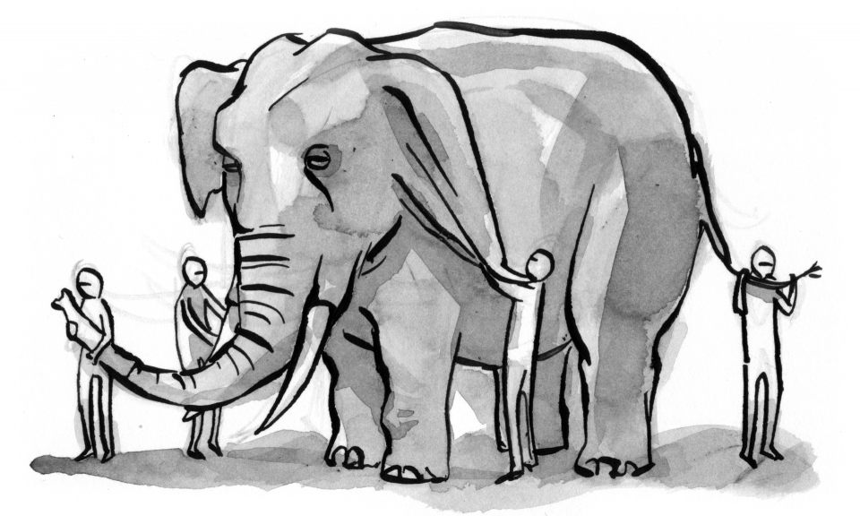

Let's take a few steps back.

- [x] Let's talk about `Lorem ipsum` and stock images. We need a *content-first* approach.
- [ ] General observations (integrate suggestions in the project brief, eg: focused causes, as close to home as possible)
- [x] Keeping **text** short is good, however it needs to be also sharp. You can capture people with images but then you use text to communicate precisely what you want to get across and encourage them to take action.
- [ ] Let's work on what your page will actually say, aka copywriting 
- [ ] Let's make it work without JS first

 
# Week 7

### Today, Wednesday 17th February 2016

1. [Content first](lets-talk-about-content)
* Workshop: copy-writing is interface design 

Change of plan, we'll keep working on *Sharing is caring* until the Easter break.

Your [homework](#homework) and [blog](#blog)!

# Let's talk about *content*

When it comes to *content* you may hear designers (including myself) saying things like

> ... the client can do it

or 

> ... the users will *generate* it

And yet, people (the vast majority of people) come to our websites **hungry for content**.

They don't care about our *parallax scrolling*, *animated SVG*, *jQuery plugins* or whatever is trendy among us. 

They want to **find** information and **do** something with it. 

#### Usable & useful content

This is not to say that we should bin all the subtle details that can make a site delightful to use, but rather that we should start talking about the *elephant in the room*. 

As designers, we should adopt a **content-first** approach. Start with content, and design our sites/apps/products etc around it.

## What is content then?

### Content is not `Lorem ipsum`

`Lorem ipsum` is gibberish that conveniently fills the available space like an expanding gas. 

It is meaningless and lacks context, revealing nothing about the relationship between your design and your content.

#### Using `Lorem ipsum` is a missed opportunity to do good design.

In this course `Lorem ipsum` is banned. I warned you.

### Stock images are the visual equivalent of `Lorem ipsum`

Using stock images is a missed opportunity to engage with **real content**.

Rather than using a beautifully irrelevant stock image, use an ugly yet relevant one. Make it clear that it's a placeholder. 

Bad images can be useful to trigger a conversation and call for good content. As the [McDonald's theory](https://medium.com/@ienjoy/mcdonalds-theory-9216e1c9da7d) states: *people are inspired to come up with good ideas to ward off bad ones*.

### A quick experiment

1. Think about a website you visit regularly. 
2. Now imagine it **without text**. 
3. What would be left?

<!--

* empty boxes
* meaningless, decontextualised images

-->

### Content is mostly **text**

Text carries [95%](https://ia.net/know-how/the-web-is-all-about-typography-period) of your page's **meaning**, and gives **context** to your media (images, videos etc.)

You can capture people with (more or less moving) images but then you need text to:

* **communicate** precisely the message(s) you want to get across 
* **persuade** people to take action

# Workshop

Let's work on what your page actually says, aka *copywriting*

General observations (integrate suggestions in the project brief, eg: focused causes, as close to home as possible)

# Homework

Let's make it work without JS first

### Blog