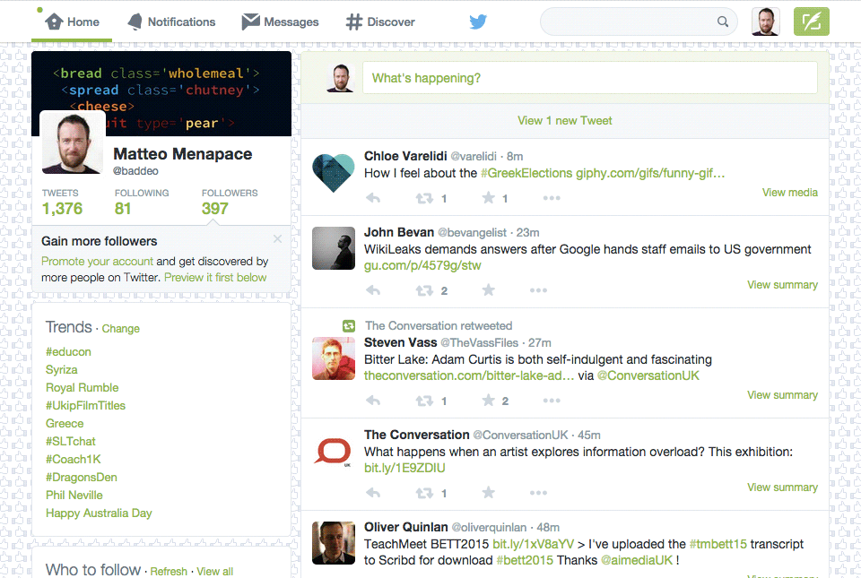
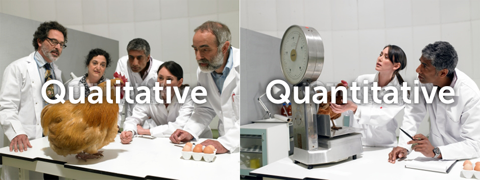

# Week 11

### Today, Friday 15th April 2016

1. [Recap](#in-the-previous-episodes): what have we done so far?
* New team project: [Our space](#team-project)
* Workshop: [**competitor analysis**](#workshop)
* What makes a [good **interview**](#interviewing-humans)? 

Your [homework](#homework) and [blog](#blog)!

# In the previous episodes

### Content is king (and queen, and drag queen)

People (the vast majority of people) come to our websites **hungry for content**.

They don't care about our *parallax scrolling*, *animated SVG*, *jQuery plugins* or whatever is trendy among us. 

They want to **find** information and **do** something with it. 

### Understanding your audience(s) is key

If you know who you are talking to, your communication will be much more effective.

* **Goals** What do they want?

* **Pain points** What are they afraid of?

* **Language** How do they express themselves? What words do they use? What references do they make?

### Content-first... 

...code later.

Learning from mistakes, when you dive into code and then realise that your content sucks.

### A few pointers on your formative hand-ins

* `Untitled.md` is not a sensible file name. A `.pdf` is not a `.md` document.

	Bear in mind that in some jobs / competitions your application would be automatically disqualified if you don't follow the *rules*. 
	
	You may complain that certain rules are arbitrary, and that stressing over them is pedantic or a waste of time, however it's important you get used to it now, rather than learning the hard way later.
	
	Also, noticing these small details and *conventions* will hugely help you become a **better coder**.

* Linking to stuff that is only on your computer won't work, e.g. `file:///Users/Afsara/Downloads/week-3-package/index.html`

	You need to **put your work online**. Best way is GitHub. [Remember GitHub and SourceTree](https://github.com/RavensbourneWebMedia/Web-Design-principles/tree/2015/sessions/01#everybody)?

* When you write about something, *anything*, always think about your **readers**. 

	Are they aware of what you're writing about? Do they know enough about your topic to understand what you are writing about? How do you know? Are you assuming they know? 

	The best way to find out is **asking someone to read what you wrote**. If anything is not clear to them, there's a good chance many more people will find that unclear. 
	
	With practice, you'll become better at *spotting your own assumptions* and make your writing clearer. However, having someone else proof-read your work is always a winner (every writer does it, no matter how experienced they are).

<!--
### Rules of the road

* Blogging regularly
* peer learning
* perusing the library
* GitHub (bounties?)
* if you can't present during assessment you'll make YouTube videos
-->

### Let's talk about being professional

#### 1. Take **ownership** of your learning journey 

Don't wait for me to tell you what to do. 

Experiment.

Ask.
	
#### 2. Try and attend **every class** 

Because learning **together** is more fun. 

#### 3. Be a good team player

If you can't attend, or are going to be late, you must **let me know**.

Remember the *tardiness tax*? Every time you're late or absent and haven't emailed me about it, I'll take 2% off your final mark.

What does this teach you?

A quick review of your [attendance](https://docs.google.com/spreadsheets/d/1BIMOmdpj4offNHLLiqnw9HNl3MA0IG_HKjJ1I9aCYQs/edit?usp=sharing)

### Announcements

* Free conference for Web design students: [Talk Web Design](http://talkwebdesign.co.uk) at Greenwich University on Thursday the 26th of May. 

	I know you have no lectures that day ;)

* Change of dates: Friday 13th > Tuesday 17th of May

# Team project

### Our space

#### On this **team project** you will *design* and *build* a website for our Ravensbourne Web Media degree

You will start from **research**: user interviews and competitor analysis. You will then define a **content strategy** and iterate your design ideas through **wireframes**. Finally, you will implement your designs into a **WordPress**-based website.

All the project material is [here](../../projects/our-space). 

# Workshop

Every project starts from **research**.

When building a site (or any *product* or *service*) you should begin by checking out how your **competitors**  are addressing similar (or the same) problems to those you are tackling with your design.

Analysing your competitors is not *cheating* or *stealing their ideas* (believe it or not, many students have this misconception).

It's about being **aware** of what's out there, getting **inspired**, asking a lot of *why* **questions**, and *would this work for my audience?* and *how could I improve that?*

### Competitor analysis

1. Open [this GDoc](https://docs.google.com/document/d/1Op6mJGxcM18Oa14tEdSDEwa0supEjEdX7x8GbAWhBsM/edit?usp=sharing) and `File` > `Make a copy...`
* Rename your copy by adding your first name at the beginning, eg `Billie - Competitor analysis`.
* Change the sharing settings for your document so that `Anyone with the link can comment`.

	
* Share the link to your document with us on the Slack `#web-dev-workshop` channel. 
* Identify the **websites of 2 competitor courses** to our Web Media BA degree. These could be degree courses that you have previously applied to, or considered applying to. 
* For each competitor, analyse their website **features**, **language** and target **audience(s)**

* `60 minutes` to **analyse** your competitors
* `60 minutes` to **present** your work-in-progress to everyone else
* `30 minutes` to **tweak** it (you'll be inspired after hearing what other people have analysed)

# Interviewing humans

Over the next week, you'll conduct some **qualitative** and **quantitative** research.

#### Quantitative research

Observe and **measure**.

Useful to answer **what** and **how** (how much, how often..) types of questions.

**Surveys** and **analytics** are (mostly) quantitative methods.

#### Qualitative research

Qualitative research is useful to answer **why** type of questions.

**Interviews** are (mostly) qualitative methods.

#### Interview guidelines

1. **Plan**: prepare a discussion guide, know what information you want to get our of the interview.
	
	Prepare a **guide, not a script**: let the conversation flow, and steer it gently.
* **Test** your interview (with team mates, family or friends).
* If possible go to **your interviewee's place**, in a space where they're comfortable, best if the space where they use the product(s) you want to test / talk about. Let them show you around.
* Easier if you interview **pairs** of users: they'll be less anxious.
* **Listen**. Don't talk about yourself.
* Be comfortable with **silence**: give people time and space to answer your question.
* Be ready to **be challenged** and improvise.
* Ask the **how** (they do stuff) and **why** (they do stuff) questions.

	**Use examples** to help people understand the type of answer you are after.
	
	**Help participants tell their stories**, what happened before and after. And what would have happened if...
* Avoid **leading questions**. Try not to bias your interviewees.

	bad > `How much do you love using XYZ?`
	
	good > `Tell me about your most recent XYZ experience` (more concrete & memorable)
* Avoid **closed questions**.

	bad > `Do you order A, B or C?`
	
	good > `How do you choose food when going out?`
* Try **casual requests** instead of questions. For instance, instead of asking `How do you store your photos?` consider asking them to show you how they store photos.	
* You're interested in them as people, not just as users
* Be respectful
* Smile :smile:

### Your turn

In teams, discuss and prepare an **interview guide** for your core audience.

* `15 minutes` to **prepare the guide** (write it on GDoc and share the link with everyone on the Slack `#web-dev-workshop` channel)
* `30 minutes` to **test** it with other teams and **tweak** it

You can start from [this GDoc](https://docs.google.com/document/d/1FP5CgvRyOCmCam_WfOAabZz4VP9BMOy0nw6-GXZwopM/edit?usp=sharing), where we jotted down some initial thoughts and questions you could ask.

# Homework

### Quantitative research

With your team:

1. Prepare an **online survey** for your target audience using [Typeform](https://www.typeform.com) (free tool).  
	
	You can find great tips on how to design surveys on [InfoActive Data Design](https://infoactive.co/data-design/ch04.html).
	
	Here's an [example of a Typeform](https://ravewebmedia.typeform.com/to/VNY71E) which I'm going to test at the [London UCAS convention](https://www.ucasevents.com/ucas/frontend/reg/tOtherPage.csp?pageID=733913&eventID=1525&mainFramePageID=733913&redirecting=1&eventID=1525) on Monday 18th and Tuesday 19th (next week). Feel free to take inspiration from it :)
* Share the survey on your social networks (for instance the Web Media FB groups) and start collecting results.

<!--

http://www.mymarketresearchmethods.com/survey-design-best-practices/

http://www.nedarc.org/media/pdf/survey_survey_design.pdf

-->

### Qualitative research

**Interview** people who you identified as part of your website audience (see [guidelines above](#interview-guidelines)), then [blog](#blog) about what you found out.

You can conduct your interviews over the phone, or via Skype/FaceTime.

Between now and next Friday, your team should have interviewed **at least 5 people** (1-2 interviews per team member). The more the better!

### Blog

*Individually*: jot down the **5 key points** for each interview as early as possible (ideally right after your interview is over) whilst they're all still fresh in your memory. 

Then *with your team*: write a **summary** of your interviews, in which you highlight **emerging patterns** (e.g. more than one interviewee pointing out the same issue).