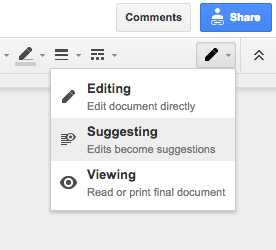
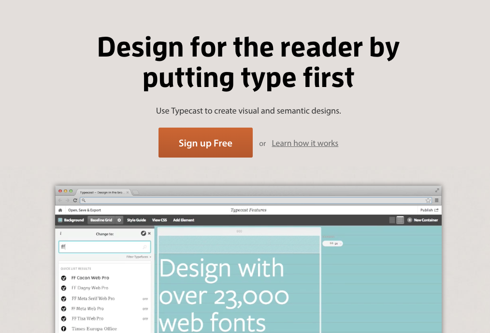
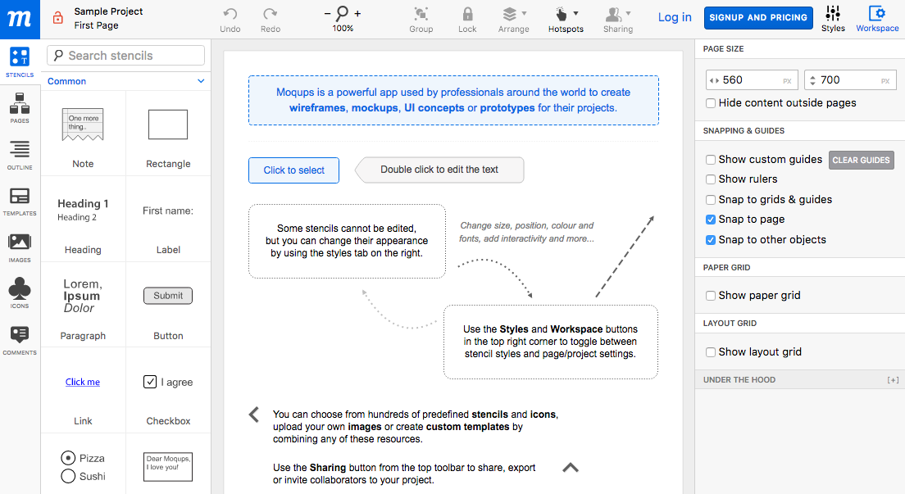
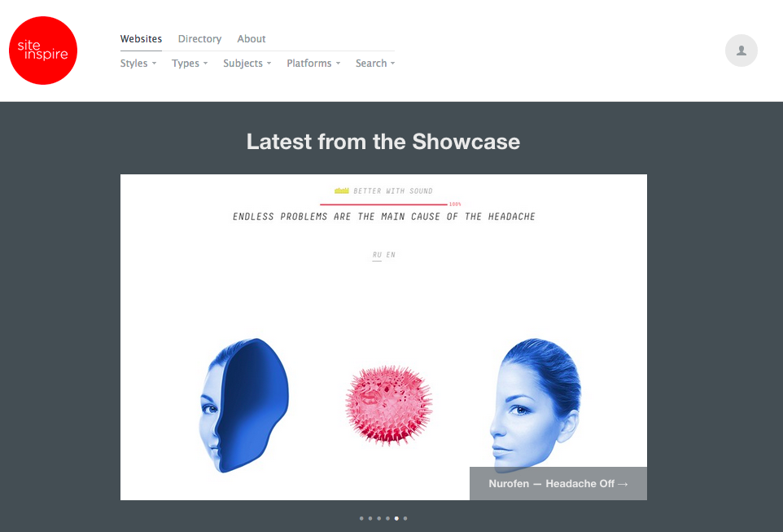

# Week 13

### Today, Monday 24th April 2017

1. [Peer-learning presentations](#peer-learning) 
* [Content strategy](#content-strategy): read out loud and edit!
* Workshop: [typesetting](#typesetting)

Your [homework](#homework) and [blog](#blog)!

# Peer-learning

Design **patterns** are a way to describe *solutions* to common *challenges*. 

[GoodUI](http://goodui.org) is an excellent resource for UI (**U**ser **I**nterface) patterns.

Each team will **present one pattern**. 

* Explain **how** that pattern works and **why**. 
* Show a few **examples** of the pattern in action. Both *good and bad examples*.   
* Explain how you could use that pattern for the Web Media site you're currently designing
* To make your mini-lesson interactive and memorable, ask **questions** to the rest of the class. For instance, you can ask people:
	* if they agree/disagree with a statement
	* guess a fact/figure before you reveal the answer
 	* how they feel about an example you are showing them

Who | What
--- | ----
Dom  | [Social proof](http://goodui.org/#4)
Jacob | [Telling who it's for](http://goodui.org/#9)
Callum | [Selling benefits](http://goodui.org/#24)
Mayur | [Loss aversion](http://goodui.org/#30)
Ricardo | [Icon labels](http://goodui.org/#47) 
Emma & Muhammad | [Natural language](http://goodui.org/#48)
Kevin | [Authenticity](http://goodui.org/#65) 
Peyman | [Putting others first](http://goodui.org/#67)
Claranz | [Concise copy](http://goodui.org/#69)

### Paste your links (slides, research, inspirations) on [this GDoc.](https://docs.google.com/document/d/1HIpwLhBqKPyxLBTkOX0eIQckrT1QEJfbqi4eUmICmZ4/edit?usp=sharing)

# Content strategy

[Last week](../12) you started working on your website's [**copy**](../12#copy). 

Today we'll **test and edit** your first draft.

## Your turn

### Test!

You'll be working with another team. 

Before you start, switch on the `Suggesting mode` in your GDoc.

1. Team A: choose one part (a couple of paragraphs) of your website *copy* and **read it out loud** to Team B.
* Team B: listen and answer these questions about what you just heard 

	* Who is this copy for?
	* When do users read this? What may they **feel** at that point?
	* What do users **need to know** (in the context of this element)? Is there any information missing? Is there too much information?
	* What must they do now, if anything? Is there a **call to action**? 
	* Are there any bits that **sound clunky** or don't flow?
	* **How else** could this copy be written?
* Team A: take notes about what may need tweaking, jot down comments and ideas.
* Swap roles. Team B read their chosen part to Team A, who listen and comment on it.
* Repeat this test for *at least three parts* of your copy.

### Edit!

Now **edit your draft**: 

* Remove the bits that are not so important
* Integrate those which are missing
* Tweak the other bits to sound like what your audience(s) may want to read.

Here are two excellent resources on *how to write* good Web content. Get inspired!

* [Writing style guide from GOV.uk](https://www.gov.uk/guidance/content-design/writing-for-gov-uk)
* [Voice & tone by Mailchimp](http://styleguide.mailchimp.com/voice-and-tone)

Here's an example of how we collectively edited a sentence:

1. Ravensbourne offers a 3 year programme that <del>opens doors to</del> unrivalled industry links and excellent graduate employment rates
* <del>Ravensbourne offers</del> a 3 year programme **with** unrivalled industry links and excellent graduate employment rates 
* <del>**Become part of**</del> a 3 year programme with unrivalled industry links and excellent graduate employment rates
* **Join** a <del>3 year</del> programme with unrivalled industry links and excellent graduate employment rates 
* Join a programme with unrivalled industry links and excellent employment rates 

# Typesetting

### Content is mostly **text**

**Text** carries [95%](https://ia.net/know-how/the-web-is-all-about-typography-period) of your page's **meaning**, and gives **context** to your media (images, videos etc.)

You can capture people with (more or less moving) images but then you need text to:

* **communicate** precisely the message(s) you want to get across 
* **persuade** people to take action

> Just choosing a font is not typography.

> It is your job as a web designer to make sure that text is **easy and nice to read** on all browsers and platforms. 

> Correct leading (line height), word and letter spacing, active white space, and dosed use of colour help **readability**.

> In summary, treat **text as a User Interface**.

### Your turn

Let's start designing how your text looks. In other words: **typesetting**.

1. *With your team*: read and discuss [10 common typography mistakes](http://www.thedesigncubicle.com/2008/12/10-common-typography-mistakes/)
* *Individually*: go to [typecast.com](https://typecast.com) and sign up. 

	

	Choose one part of your website's copy and paste it into Typecast. 

	Start playing around with fonts, proportions, line-heights, white space and colours. If you like structure, you can try [GridLover](http://www.gridlover.net/try).
	
	**Take screenshots** of each variations you produce (you'll have to submit those at the end of this project).

# Homework

### Wireframes

Wireframes are about **content**, **context** and **interaction**. 

* Use **real content**, never *lorem ipsum*. 
	
* **Words** are key. [Interface design is copywriting](https://gettingreal.37signals.com/ch09_Copywriting_is_Interface_Design.php)
	
* Think about **button labels**, how do you label user actions: is it `Share` or `Post` or `Publish` or `Say it!` or `Broadcast` for instance?  

*Individually*: **wireframe two pages** for the Rave Web Media website using [Moqups](https://moqups.com/).

The goal is to get your idea down on paper so that you can **present** it to everyone else later. This is to help others **visualise** your ideas and give you **feedback**. 

Heads up: these are not throw-aways! Make sure you take screenshots of your wireframes. These will document how your idea is evolving and **you will be marked on this**.

### Moodboard

*As a team*: create a **moodboard** for your website design.

* Use [Pinterest](https://www.pinterest.com) to assemble all your inspirations and ideas
* Include at least 3 websites that you consider *worth copying* (and explain in the comments what you're going to *steal* from them and why)
* Post screenshots of both macro-views (entire pages) as well as micro-views (details)
* You can also post your own sketches, photos or any other material that can help you and us understand and talk about which direction your design is moving towards

There are tons of [moodboards on Pinterests tagges as *webdesign*](https://www.pinterest.com/search/boards/?q=webdesign).

Also, check out [SiteInspire](http://www.siteinspire.com) and [Panda](https://usepanda.com)!

### Blog

Read and blog about [10 common typography mistakes](http://www.thedesigncubicle.com/2008/12/10-common-typography-mistakes/)

You can use the following questions as a guide for your blogging:

* Have you made any of these mistakes? (It's ok, we all have) 
* Can you show a few examples of websites that feature one (or more) of these mistakes?
* How can you avoid making any of these mistakes in the Rave Web Media website you're designing?
