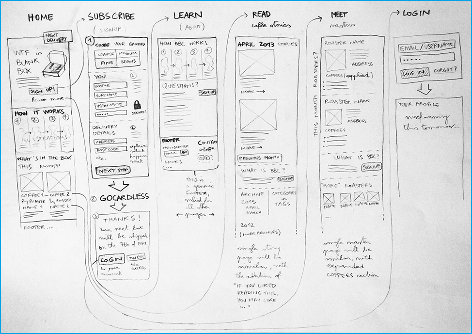
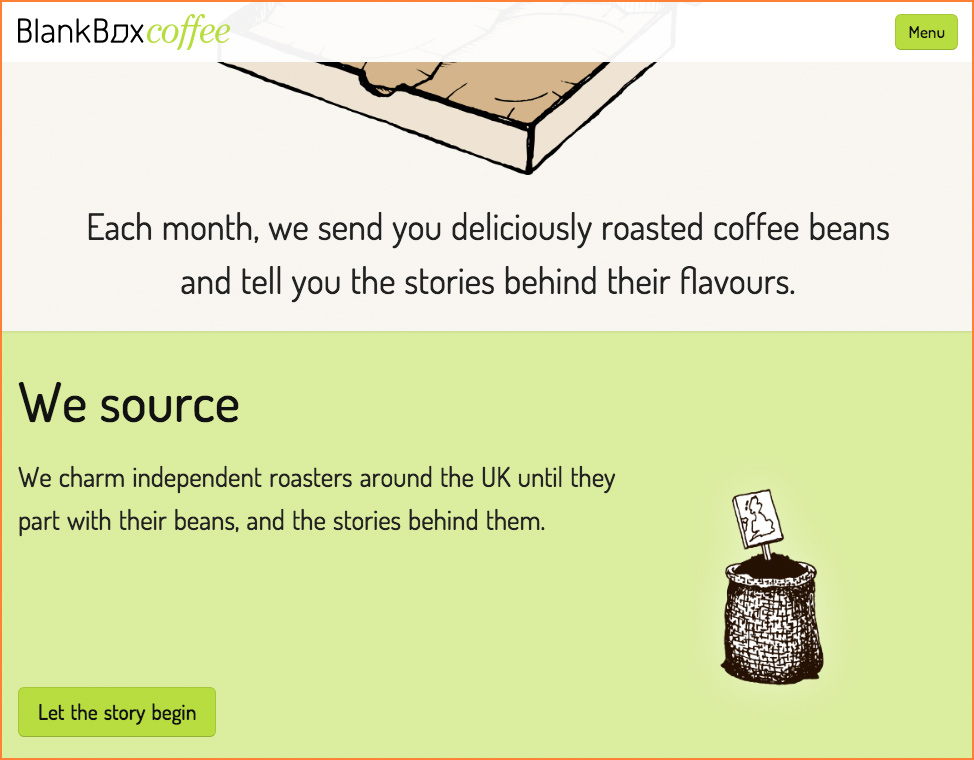

# Week 14

### Today, Friday 6th May 2016

1. [Prototyping with HTML&CSS](#browser-prototyping)
* [Front-end frameworks](#front-end-frameworks)   
* [Tutorials](#tutorials) on *Our space* 

<!---->
- [ ] HEADS UP! Next session will be **Tuesday** 17th 

Your [homework](#homework) and [blog](#blog)!

# Browser-prototyping

## The web-design process

*According* to Matteo (and many others):

1. [x] **Research** and **content strategy**: gathering information and thinking through information architecture, navigation and typography
* [x] **Sketches** and **wireframes**: exploring ideas for layouts and content structure
* [ ] **Prototype**: creating 2–3 *key* pages using HTML & CSS. Much of the design process happens here
* [ ] **Development**: building the site (e.g. with WordPress) and refining the design

This **iterative** process helps me **refining ideas** and **focusing** on one thing (usually the *appropriate* thing) at a time. I like starting with type, grid and layout, then add colours and images. 

### Here's an example 

From [BlankBox](https://blankboxcoffee.com), a coffee subscription project I worked on a couple of years ago (sadly not operating anymore):

1. **Design** (a bit of) content strategy + **wireframes** on paper 

		
* **Prototype** with HTML + CSS using Bootstrap (a front-end framework, more on that below) and **iterate** 
	
		
* **Build** the product (with WordPress + many plugins) and **test** it with real people

	
* Back to the *drawing board*...	 
<!-- -->
## Why prototyping with code?

### What about Photoshop?

Photoshop (and similar) allows you to create *static mockups* but doesn't let you design the **states** of an interface: how does your layouts reflow and adapt to different screen sizes, how do interactive elements respond to click touch and other events? 

This is dangerous, as you may end up with an *artist's impression* of a Web page, rather than designing the complex, dynamic thing which is a Web page.

A Photoshop mockup needs to be interpreted (by the coder *translating* it into the real thing) which can lead to a lot of inefficient and unnecessary back-and-forth. 

### **HTML + CSS prototypes** instead...

#### Responsive 

Because they're built with code and you can test them directly in your browser, HTML + CSS prototypes are better at demonstrating **responsive** behaviour.
	
One of the biggest challenges in Web design is the huge and constantly growing number of device screen sizes (here are [286 common ones](http://viewportsizes.com/)).
 
Would you design 286 different mockups in Photoshop?
	
#### Accurate

HTML + CSS prototypes can give you (and your clients) an **accurate representation** of the way your product will really look and function. 
 
For example, *fonts* often look slightly different across various browsers than in Photoshop (and similar). This can cause delays and confusion among clients, who often expect your product to be a *pixel-perfect* match to mockups. See [Make it like the PSD!](http://dangovan.com/make-it-like-the-psd)

#### Consistent 

HTML + CSS prototypes reduce the chances of **errors** and inconsistencies.
	
CSS enforces **consistency** across your design (for instance, applying the same `margin` to all your paragraphs). Making changes is quick and efficient.
	
Photoshop... well, try and change all those buttons from `red` to `green`.

#### Catch real issues, early on

HTML + CSS prototypes allow to **catch potential issues** before they become real problems. 

This provides an early opportunity to adjust how your product works, rather than waiting until front-end development is completed.

#### Save :clock1130: and :moneybag:

In essence HTML + CSS prototypes can **save you time** and money. 

**Your product will be viewed in a browser** so it makes sense to use the browser (and its *native* languages) early on in the creative process, doesn't it?
	
	
## How to prototype with code?

- [ ] [The ultimate guide to designing in the browser](http://usersnap.com/blog/guide-designing-in-the-browser/)
- [ ] [Tips for designing in the browser](http://webdesign.tutsplus.com/articles/tips-for-designing-in-the-browser--webdesign-10340)
- [ ] [How I rapidly prototype websites](http://blog.teamtreehouse.com/rapidly-prototype-websites)
- [ ] Use Chrome Web-tools inspector

Start *translating* your **wireframes** into HTML & CSS.

* Make **up to 3 HTML pages**, eg: *checkout*, *about* and *home*. If your project has less than 3 pages, show different *states* for a page, eg: before and after submitting a form

* You can **initialise** this task using [Bootstrap](http://getbootstrap.com/) or [Skeleton](http://getskeleton.com/) to lay the foundations of your pages

* First, **structure the content** of your chosen pages with HTML. Decide what tags are appropriate for your content: consider [**semantic** tags](http://www.w3schools.com/html/html5_semantic_elements.asp) like `<header>`, `<footer>`, `<section>` and `<nav>`. Use `
` elements as your *last resort*

* Then, apply **design and style** with CSS. If you're using a  boilerplate or framework, don't tamper with their CSS files. Instead, create your own separate `style.css` (or whatever you decide to call it). Even better, create many CSS files, eg: `general-rules.css`, `typography.css`, `colours.css`, `slider.css`, `home.css`...

### HTML & CSS prototypes

Remember prototypes are not about the final look and feel. 

Keep them *unfinished* and focus on real content and navigation, flesh out as many pages as possible.

You can use a framework like [Skeleton](http://getskeleton.com) or [Bootstrap](http://getbootstrap.com).

Skeleton is easier to learn, Bootstrap is more complex but also very popular and has lots more hackable themes and tools (see below)

<!--
### Hungry for more CSS tutorials?

You can find loads of animation [tutorials on Codrops](http://tympanus.net/codrops/category/tutorials), using a mix of CSS and SVG (scalable vector graphics).
-->

# Front-end frameworks

### Tools

Bootstrap builders

- [ ] http://blocsapp.com
- [ ] http://brix.io
- [ ] http://www.bootply.com
- [ ] http://pingendo.com (FREE!)

# Tutorials

### Content + wireframes

* Is anything important missing from this page?
* Is the most important content the first thing you notice?
* Is there anything on this page that shouldn't be there?
* Do you know what all of the elements on this page are?
* Can you get to all of the major sections of the site from here? Should you be able to?
* Do all of the labels make sense?

# Homework

### Keep prototyping 

- [ ] 

### Prep formative

- [ ] This is a checklist of what we want you to present during your formative assessment

### Blog

Choose one of the following Web design *myths* and blog about it.

1. [People don't scroll](http://uxmyths.com/post/654047943/myth-people-dont-scroll)

2. [White space is wasted](http://uxmyths.com/post/2059998441/myth-28-white-space-is-wasted-space)
	
3. [Design has to be original](http://uxmyths.com/post/712377283/myth-9-design-has-to-be-original)

4. [Graphics will make a page element more visible](http://uxmyths.com/post/702072231/myth-graphics-will-make-a-page-element-more-visible)

5. [The homepage is your most important page](http://uxmyths.com/post/717779908/myth-the-homepage-is-your-most-important-page)

6. [Design is about making a website look good](http://uxmyths.com/post/654070104/myth-design-is-about-making-a-website-look-good)

Questions that could guide your blog post (in no particular order):

* Where do you think the *myth* you chose may come from? Eg: *why do some people believe that users don't scroll webpages?*
* Where did you hear about this *myth*? 
* If you feel like it isn't a *myth*, what are the reasons? 
* What are alternative ways to approach the design problem that the *myth* addresses?