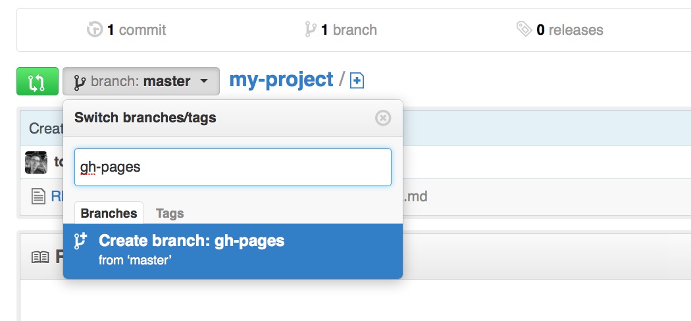
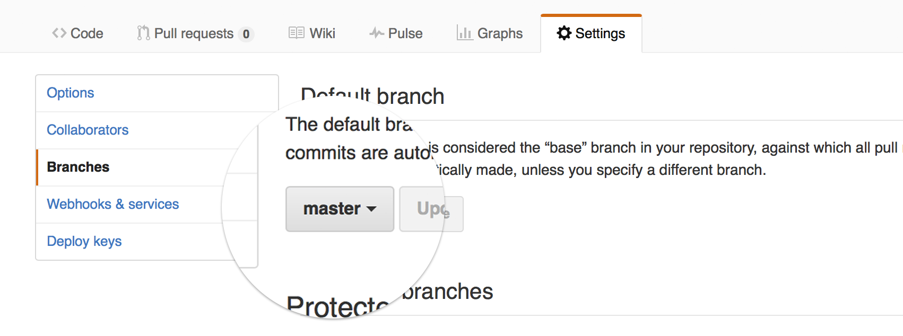
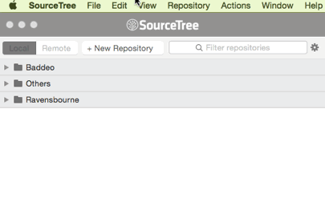

# Week 15

### Today, Monday 8th May 2017

1. **Formative** presentations 
* **Workshop**: hacking a Bootstrap template and publishing your work to GitHub Pages

<!-- Workshop: Meet PHP, *variables* and *functions* -->

- [ ] HEADS UP! **FREE** [talkwebdesign.co.uk](http://talkwebdesign.co.uk/) 26th of May @ Greenwich University: get your ticket if you haven't already!

<!-- Your [homework](#homework) and [blog](#blog)! -->


# Formative presentations

You'll present your work-in-progress on [**Our space**](../../projects/our-space) to me and a couple of guests (no worries, they're friendly people and you may have seen them around Ravensbourne before ;)

### WTF should we present?

Prepare a pitch presentation:

* Who are your **competitors** and how do they communicate online? 
* Who is your **target audience**? You could start from your **research** (surveys and interviews) and then present your **personas**. 
* How are you going to communicate to your target audience? In other words, what is your **content strategy**? You can show examples of your **copy**, as well as presenting your **content map**.
* What are your inspirations? You can show your **moodboard**  of ideas.
* How are you structuring your content? You can present your **wireframes** at different stages, from paper sketches to digital wireframes, to the HTML + CSS **prototype**.
* What are your **next steps**?

The points above are the bare minimum of what your presentation should include. You're very welcome to present them in a different order and include any other aspects which you consider relevant.

### How long should our presentation be?

Roughly **15 minutes** per team, plus 5 minutes for feedback and questions.

### Collaborative feedback

Let's give each other feedback in this [collaborative Google doc](https://docs.google.com/a/rave.ac.uk/document/d/1QDETyR6BwffMhoyTvSvtJ5Hhzj3K6zzd38py_EymAOw/edit?usp=sharing)!
	
<!--
### Banned words


* *Like it* / *Don't like it*
* Empty
* Minimal(istic)
* Modern
* Poor
* Professional
* Simpl(istic)
* Static
-->

# Workshop

Together, we'll learn how to use [Bootstrap](http://getbootstrap.com/) to quickly prototype a Web page and then publish it live on [GitHub Pages](https://pages.github.com/).

<!--
Don't fancy reading the tutorial, want to **download and play with the code** instead? Here it is.
-->

### Tools you'll need

* A browser: Chrome or Firefox (**not** Safari or IE)
* A code editor: [Brackets](http://brackets.io/) or [Atom](https://atom.io/)
* [SourceTree](https://www.sourcetreeapp.com/), a free app to manage Git-based projects. 
* A [GitHub (free) account](https://github.com/join).
* The [Bootstrap docs](http://getbootstrap.com/css), aka the *instructions manual*.

### Step 0. Setting up GitHub Pages

Go to [github.com](https://github.com) and *log in*.

#### One person per team, let's call her person `A`

1. [Create a new *organisation*](https://github.com/organizations/new) for your project team.
* Choose the *Open Source* (free) plan.
* Invite all your teammates to the new organisation.
* Get all your teammates to visit the organisation page (it will be something like `github.com/ORGANISATION_NAME`) click on the `View invitation` button on the top-right and **join** the organisation.
* Once a teammate joined, you can go to the `People` tab of your organisation and make them an **owner**. 

	This will grant them the same privileges as you, because we like everyone to be *equal*.

#### Another person in the team, let's call her person `B`

1. Make sure you have joined the team organisation and person `A` made you an owner of the organisation.
* **Create a new repository** for the *Our space* team project.
* Make sure you `Initialize this repository with a README`.
* Once GitHub has created your new repository, click the branch drop-down on the left-hand side, type in `gh-pages` and press Enter. This will make a new branch, where your project will be published.

	
* Go to the repository settings. In the Branches section, change the default branch to the newly created `gh-pages` branch.	

	
	
#### Everybody

1. Open [SourceTree](https://www.sourcetreeapp.com/).
* **Clone** the *Our space* repository on your computer.

	`File` > `New / Clone`
	
	The *Source URL* will be your repository URL, something like `https://github.com/YOUR_ORGANISATION/OurSpace`

		
	
### Step 1. Bootstrapping your page 
	
<!--HTML first, CSS later.-->

1. [Download Bootstrap](http://getbootstrap.com/getting-started/#download).
* **Move** the Bootstrap folder inside your repository folder.
* **Rename** the Bootstrap folder with your name, e.g. `matteo`.
	
	You'll save all your work for today in that folder.
* **Open** the folder with Brackets / Atom.
* Make an `index.html` file and **copy-paste** in the [basic Bootstrap HTML template](http://getbootstrap.com/getting-started/#template).
* **Save** `index.html` and open it in your browser. You should see a blank page saying `Hello, world!`

### Step 2. Publishing your work

1. In SourceTree, **stage** all the files, then write a commit message (could be `Bootstrapping` for example) and then **commit**.
* Notice that as soon as you commit, a red `1` appears on top of the `Push` button. In order to upload your folder to GitHub you need to **push** it.
* …and it's up! Open your browser and point it to `http://YOUR_ORGANISATION_NAME.github.io/YOUR_REPOSITORY_NAME/YOUR_NAME`, e.g. `http://thedestroyers.github.io/ourspace/matteo`

### Step 3. Adding your style

It's good practice not to mess around with the Bootstrap source (or any framework's source) but rather keep your changes in separate files. 

1. **Create a new CSS file** to store your own styles. Save  it as `YOUR_NAME.css`, e.g. `matteo.css` inside the `css` folder.
* Make sure you include the new CSS file in the `head` of your `index.html` like so

	```html
	... existing head code
	<link href="css/matteo.css" rel="stylesheet">
</head>
```	
<!--
### Step 4. Get inspired
-->