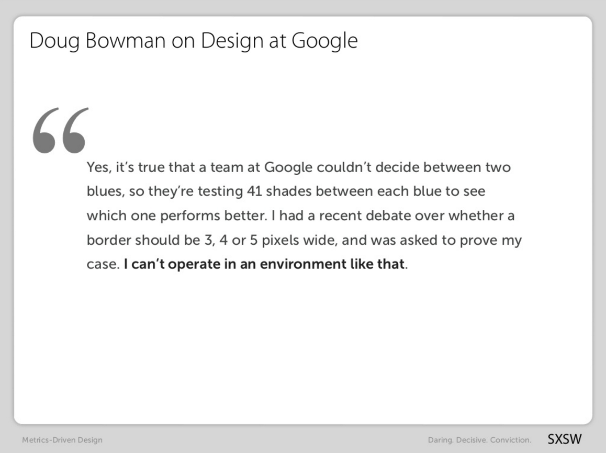
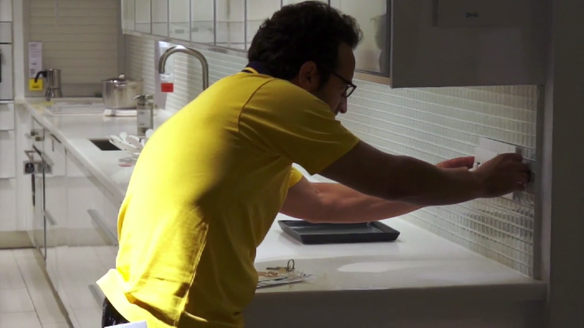
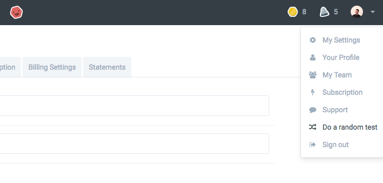

# Week 17

### Today, Friday 27th May 2016

1. [User-testing](#user-testing): why, when and how
* Group tutorials on *Our space* 
* Individual tutorials on *Sharing is caring*

Your [homework](#homework) and [blog](#blog)!

- [ ] Stand-up (huddle)
- [ ] Appoint new PMs

# User-testing

### Why?

* Because we can't design on **assumptions** only, we need some **evidence**
* Because when we work on something (anything) we gradually lose a fresh, **unbiased view** of it
* Because people may have different **mental models** than ours
* Because we need to spot and correct **problems** as early as possible
* Because loads of **usable** features may not be **useful** (your priorities may not be users' priorities)
* Because the way you call things may not be the way users refer to them 

### When?

* End of design?
* Once you're live?
* **Now**?

### How much?

#### Is it more effective to test 100 people or 10?

#### Is it better to test 100 people once or 10 people twice? 

<!-- Test many times, few people at a time -->

User-testing is **iterative**, you should do small tests as often as possible, not just once.

### Who?

Ideally you'd pick someone who's **representative** of your target audience, but following the principle that *some testing is way better than no testing* you can pick anyone really: friends, relatives and colleagues.

## A few examples

### A/B testing

A/B testing is a **randomised experiment with two variants**: A and B. 

Versions A and B are **identical except for one variation** that might affect users' behaviours. Don't make A and B too different, otherwise you won't be able to tell which variation is actually affecting how users interact with your prototype.

<!--You can A/B test both digital and physical prototypes.-->

<!-- Click the image for a slide show on how Google tested millions of shades of blue to optimise their traffic and click through rate -->

At Google they're obsessive about A/B testing:

### Fake it till you make it

<!--Hack IKEA-->

Independent design studio Upwell went undercover to test the validity of their new product by using IKEA as their testing ground.

> IKEA is the perfect retail research lab. They have an ideal demographic and amazing consumer exposure for Upwells new product, Walhub. Upwell created IKEA-esque visuals - product tags and UPC barcodes as to not bias their experiment, and even went so far as to dress up as an IKEA employee in order to install Walhub without raising too much suspicion. They set up mics and cameras to record the experience and more importantly the consumer feedback.

[Watch the experiment on Vimeo](https://vimeo.com/79313674).

### 5 seconds test

You can use [fivesecondtest.com](http://fivesecondtest.com) to upload your wireframes or prototype screenshots. Testers will be shown your design for 5 seconds and then will be asked a question about it.

Picking the right **question(s)** to ask after the 5 seconds impression is key.

Don't just use the default ones (like the horrible *Is the brand memorable?*). What do you actually want to learn from this test? 

When considering what to ask your testers, ask yourself:

> Will testers be **willing** and **able** to provide a truthful answer to my question?

> From [On surveys](https://medium.com/research-things/on-surveys-5a73dda5e9a0#.3vujbmw95), an excellent short article by Erika Hall, author of *Just enough Research* (available from the Rave library). 

You can use this type of test also for A/B testing.

#### Your turn

Let's start with some quick *remote* (online) user-testing.

1. Sign up for a free account on [UsabilityHub](https://usabilityhub.com/users/sign_up).
2. Do a few random tests to see what it's like, and collect *credits* for your own tests.

	
3. Create one test (or more if you feel like). You can choose between 3 types of test:

	* **Five Second** to capture your users' first impressions
	* **Click Test** to understand what your users click
	* **Nav Flow** to see if your users can successfully get from A to B
4. Share the test URL with your friends on Facebook, with your followers on Twitter etc. 
	
	 
5. Your mission is to get at least 20 tests by next Friday!

<!--
## Types of user-testing

### Quantitative vs qualitative

* **Quantitative** testing is used to observe and measure behaviour, generally resulting in statistical data. 

	**Surveys**, **tree testing** and **analytics** are quantitative methods. 

* **Qualitative** testing is used to gather insights on what users are experiencing when they behave or why.

	**Interviews** and **lab testing** are the most common qualitative methods. 	
-->

### Remote vs face2face

* In **remote testing** respondents are always contacted remotely, usually via the Web.

* **Face2face testing** is held with the user in person. 

	Ideally you would have a *facilitator* conduct the test while you observe and take notes. 

	This is because it's tricky not to *feel personally attached* to something you've made, also you may be tempted to *give directions* to users and they may feel *less inclided to express their honest feelings* if they know you've made the thing they're testing. 

	However, affording a facilitator is not always possible so you may have to be the facilitator of your own face2face tests.

	It's vital to **take notes** and highly recommended to **record** user-tests. 

	You can use [Silverback](http://silverbackapp.com) to video-record your sessions on any device with a front-facing camera. The result is a video that shows you both the screen people are interacting with, and they're faces while they're testing (and their voices too).

	[Download Silverback](http://silverback.s3.amazonaws.com/silverback2.zip)

Most types of testing can be done both remotely and face2face.

# Homework

### Get 20 remote tests

As a team, get at least 20 tests of your *Web Media site* concept by next Friday.

Bear in mind you'll have to hand in evidence of this in a couple of weeks and you'll be marked on it.

### Test your site face2face with at least 2 users

First watch this user-testing video, from a former student

Can you spot a few issues in the way the *facilitator* conducted the test?

<!-- 

	* Explained testers what the app is about, instead of asking them
	* Think out loud if you can
	* What is the point of this test?
	* Facebook tab open before you show the actual thing
	* If there's something important in the bottom-right corner of your screen, it would be better if it wasn't hidden in the final video
	
 -->
 
As a user-testing *facilitator* your main job is to make your testers not feel stupid:

* state clearly that you're testing the the app, not them
* reassure them it's not their fault if what they do has an unexpected result
* encourage them to **think out loud**
* **no hints**, instead encourage them to think what they'd do if you weren't there
* be kind and **patient** 
* **don't take it personally** if they don't get what you think it's obvious, but try and understand why
* ask **specific questions**
* no orders, but rather give some choice to your testers (eg: *What would you click first?*)

<!-- -->

1. Prepare a loose script for your user-testing sessions. You can take inspiration from this [sample script](https://docs.google.com/document/d/17IuAMJojz0dlvBFh7QBDBgUWun2NyRZ6hlRwLdqYcH0/edit?usp=sharing) (*clone* it into a new Google doc).
2. Download and install [Silverback](http://silverbackapp.com)

	If it doesn't work, you can use PhotoBooth and QuickTime for screen recording.

	Windows users, I'm sorry but you're on your own :)
3. Find at least **2 people** to test your site with. 

	They should not be your mum / dad / sibling / boyfriend / girlfriend. 

	The most interesting and useful insights come from people that are unbiased and not connected to you personally, so try and find someone outside of your *comfort zone*.

	You may offer them a **small reward** for giving you their time. Buy them a coffee, or a little present.

Bear in mind you'll have to hand in evidence of this in a couple of weeks and you'll be marked on it.

